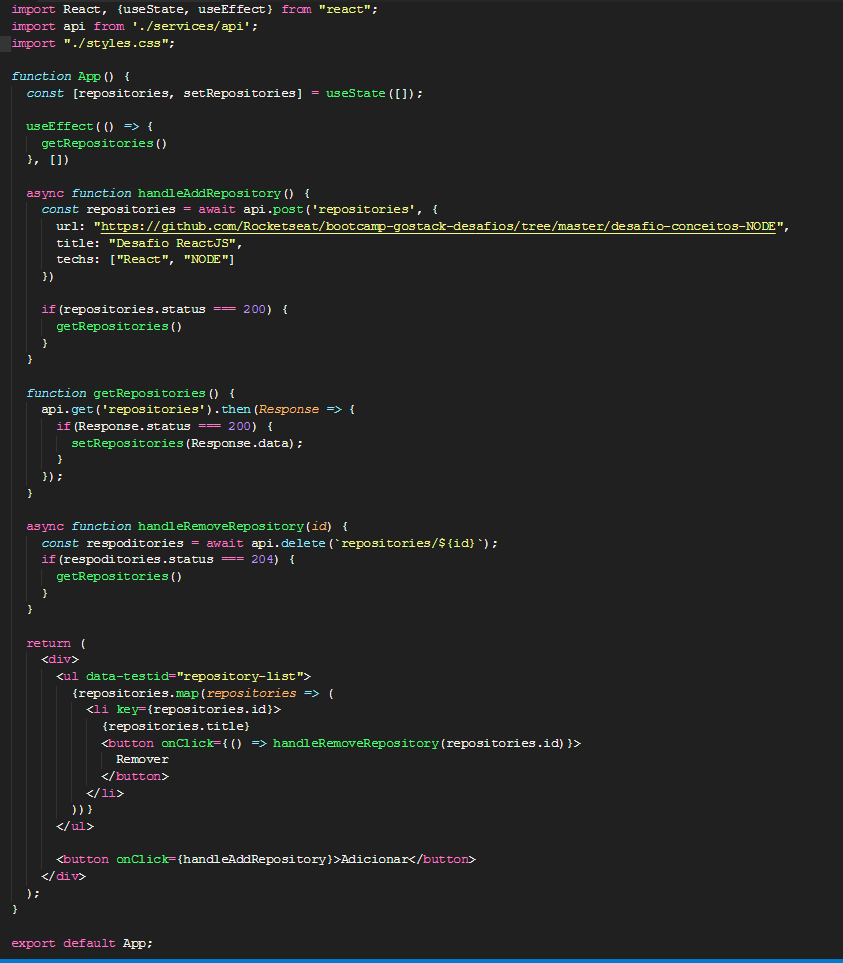

<!-- # bootcamp-gostack-desafios -->

<h3 align="center">  Desafio 3 - Conceitos ReactJs </h3>

### Sobre o desafio

Aplicação para listar, adicionar e remover repositories através da api feita no desafio de conceitos de NodeJs

### O Código

- Create : através da função handleAddRepository
- Read (list) : através da funcão 
- Delete : atravpes da funcão handleRemoveRepository

---

> Conceitos do foguete. 
